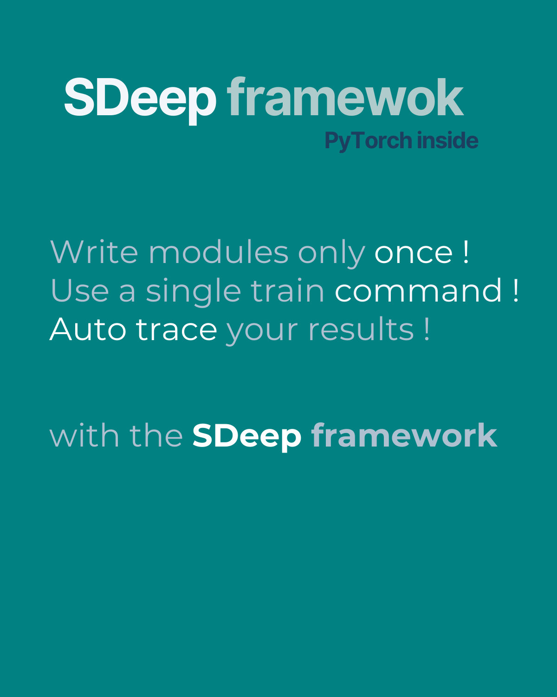

SDeep
=====

`SDeep` is a python framework based on ``PyTorch`` to ease the training of light deep learning models locally.
Each training component (transforms, datasets, models, loss, training workflow, evaluation...) are
implemented as independent python classes. A single command line with a composition JSON file
allow to train all the combinations of components and hyper-parameters without rewriting code.

.. image:: images/caroussel/1.png
  :width: 225
  :alt: Alternative text

|

.. image:: images/caroussel/4.png
  :width: 225
  :alt: Alternative text

.. image:: images/caroussel/5.png
  :width: 225
  :alt: Alternative text

.. image:: images/caroussel/6.png
  :width: 225
  :alt: Alternative text

Why `SDeep`
-----------

1. Training a model requires testing multiple workflows and hyperparameters, often leading to repetitive script execution.
2. Saving training scripts as notebooks or standalone files complicates adaptation to different computers or datasets, requiring additional effort.
3. Ensuring traceability (FAIR principles) of data and results demands extra work to integrate code, models, validation results, and predictions.

SDeep streamlines the entire training process and ensures traceability within a single, unified framework.

Principles
----------

Principle 1: Write only once
~~~~~~~~~~~~~~~~~~~~~~~~~~~~

SDeep's goal is to eliminate the need for repeatedly writing training loops, datasets, or loss functions. By 
defining each component once and creating a workflow to assemble them, you can easily test, version, and reuse 
these components across different project, environments and datasets.

Principle 2: Commands not scripts
~~~~~~~~~~~~~~~~~~~~~~~~~~~~~~~~~

Command-based programs are easier to maintain and distribute compared to a collection of dedicated scripts. A 
standardized command line allows any user to install and run the program with minimal effort. In contrast, using 
scripts requires additional work from the user to install dependencies, adjust inputs and outputs, and locate 
hyperparameters.

Principle 3: Keep it simple, stupid
~~~~~~~~~~~~~~~~~~~~~~~~~~~~~~~~~~~

SDeep is built on PyTorch and leverages all its existing components, avoiding the need to reinvent loss functions, 
datasets, and other elements.
`SDeep` only introduce:

1. The *Workflow* class for assembling and monitoring a training
2. A unique API and CLI with a plugin discovery mechanism to run and monitor trainings
