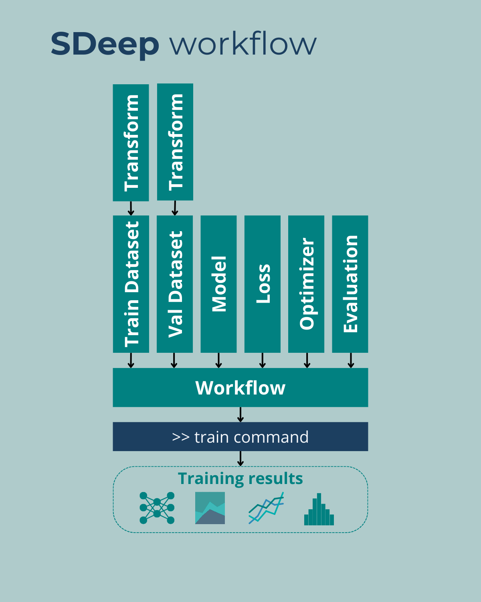

Guide
=====

Design
------

`SDeep` is designed to run deep learning trainings locally with a single command line and deep
learning components implemented as independent modules.

The scheme bellow shows the general architecture of a model training with `SDeep`. The core
component is the *Workflow* that own the training loop and all the training I/O. The *Workflow* is
feed with the model training components:

1. **Transform**: is a module to transform the input data before training. Transformation here means
   mainly data scaling and data augmentation transformations

2. **Dataset**: is component to read and iterate training and validation data from storage. It is
   implemented using the `PyTorch` `torch.utils.data.Dataset`

3. **Model**: is the neural network implemented using the `PyTorch` `torch.nn.Module`

4. **Loss**: is loss function to be minimized. It is implemented using the the `PyTorch` loss module

5. **Optim**: is the gradient back-propagation method to use for the training. It is again based on
   `PyTorch` definition from `PyTorch` `Optimizer`

6. **Eval**: is a module introduced in `SDeep` to measure and save result quality metrics during and
   the after the training.

How to
------

This section show a basic introduction on how to use the `SDeep` framework. Please refer to the API
documentation for more advanced features.

Run a training
~~~~~~~~~~~~~~

The simplest use case is when all the needed modules for training are already available in `SDeep`.
Wen then just need to run the `sdtrain` command line with a parameter file. The parameter file is
a json file that define the training workflow and all the input modules needed for the training
(Dataset, Model, Optim, ...)

Bellow an example of parameter file for the MNIST classification *Hello world* example:

.. code-block:: javascript

   {
        "model": {
          "name": "MNistClassifier"
        },
        "loss": {
          "name": "CrossEntropyLoss"
        },
        "optim": {
          "name": "Adam",
          "lr": 0.001
        },
        "workflow": {
          "name": "ClassificationWorkflow",
          "epochs": 3,
          "train_batch_size": 64,
          "val_batch_size": 1000,
          "save_all": true
        },
        "train_dataset": {
          "name": "MNISTClassif",
          "dir_name": "mnist_train",
          "train": true
        },
        "train_transform": {
          "name": "VisionScale"
        },
        "val_dataset": {
          "name": "MNISTClassif",
          "dir_name": "mnist_train",
          "train": false
        },
        "val_transform": {
          "name": "VisionScale"
        },
        "eval": {
          "name": "EvalClassification"
        }
    }

The parameter file is in JSON format and is self explanatory. Each root object is an instance of a
module needed by the workflow for training. The *Workflow* we use here is *ClassificationWorkflow*
which is a training workflow optimised for image classification. We set workflow parameters like
the number of epoch and the option to save all the models and eval results for each epoch. The model
is *MNistClassifier* which is a small image classification network with 2 convolution layers with
max-pooling for feature extraction followed by fully connected layers for classification. The loss
function is the *CrossEntropyLoss*, the optimizer is *Adam* with a step of *0.001*. For the
datasets, with instantiate the MNIST dataset in *train* mode for the training *train_dataset* and in
test mode for the validation *val_dataset*. Both datasets take at input the *VisionScale* transform
that scale the image intensities in [-1, 1]. The last module is the *eval* module. Here we chose the
*EvalClassification* module that compute precision, recall, F1 score and the confusion matrix on the
validation set and save the result in the training report directory

After the training, all the results are saved in the *run* directory by default.

.. note::
    The output dir can be changed in the `sdtrain` command line with the option -s

This directory contains:

1. **checkpoint.ckpt**: a backup of the last epoch to restart from it if needed. It can be used with
   the `-r` option of the `sdtrain` command line

2. **log.txt**: a log file with all the training verbose information. It is similar to what is writen
   in the console during training

3. **events.out.tfevents.\***: the tensorboard file that save the training curves and other
   monitoring data depending on the *Workflow*

4. **eval**: a directory containing all the model evaluation outputs. For exemple, the
   *EvalClassification* module save 2 files: *confusion_matrix.csv* and *scores.csv*

6. **predictions**: depending on the workflow, a prediction directory contains the predictions of
   the model on the evaluation dataset.

Run a prediction
~~~~~~~~~~~~~~~~

To run a prediction from a model generated by a `SDeep` training, we just need to run the
``sdpredict`` command. This command can be ran on a file:

.. code-block:: shell

    sdpredict -i filepath.tif -o prediction.tif -m model.ml

or on a directory

    sdpredict -i input_dir/ -o output_dir/ -m model.ml --e ".tif"

There is no need to transform the data before calling the ``sdpredict`` command because the command
will automatically apply the validation set transform used during the training for prediction.

Create custom modules
~~~~~~~~~~~~~~~~~~~~~

The main goal of the `SDeep` framework is to ba able to create custom models, loss or even
workflows. In the following we are going step by step in how to create a custom module for training
a model.

First, we need a directory where we will create a python module that follows the `SDeep`
architecture.
Basically, the `SDeep` command line tool will search for modules who's name starts with `sd_` and
contains submodules names as the `SDeep` modules (datasets, evals, losses, models, optims,
transforms, workflows). All the modules are not mandatory, and you can implement only the one you
need.

Thus two architecture of your python module are possible. If we need to implement only one module
per component, we can just create a module file per component:

| my_project
|   \|-- __init__.py
|   \|-- datasets.py
|   \|-- evals.py
|   \|-- losses.py
|   \|-- models.py
|   \|-- optims.py
|   \|-- transforms.py
|   \|-- workflows.py

of if we plan to implement multiple modules per components, it may be more clear to separate them
into sub modules using directories:

| my_project
|   \|-- __init__.py
|   \|-- datasets
|     \|-- __init__.py
|     \|-- dataset1.py
|     \|-- dataset2.py
|   \|-- evals.py
|   \|-- losses.py
|   \|-- models.py
|   \|-- optims.py
|   \|-- transforms.py
|   \|-- workflows.py

For `SDeep` to be able to find instantiate dynamically the modules, we need to declare them using
the export variable. This means that in each module file, their should be a line similar to

.. code-block:: python

    export = [MyDatasetA, MyDatasetB]

Lets write a full example with a dataset only. Consider we want to create a dataset for image
denoising using the MNIST dataset.

We first create a directory for our python module:

| my_denoising
|   \|-- __init__.py
|   \|-- datasets.py
| params.json

The `__init__.py` file can stay empty, it only declare to python that it is a python module. In the
`dataset.py` file we can create our dataset as a regular `PyTorch` dataset

.. code-block:: python

    class MNISTDenoising(Dataset):
        """Dataset to use the MNIST data for denoising learning

        :param dir_name: Directory where the MNIST data are downloaded locally
        :param noise_sigma: Standard deviation of the random gaussian noise to add
        :param train: True to use train set, false to use test set
        :param transform: Transformation to apply to the input images (data augmentation)
        """
        def __init__(self,
                     dir_name: str,
                     noise_sigma: float = 0.025
                     train: bool = True,
                     transform: Callable = None):
            super().__init__()
            self.mnist = MNIST(dir_name, train=train, download=True)
            self.noise_sigma = noise_sigma

        def add_noise(self, image: np.ndarray) -> np.ndarray:
            """Add Gaussian noise to an image

            :param image: Image to process,
            :return: The image with added noise
            """
            noise_img = np.random.normal(0, self.noise_sigma, image.shape)
            return image + noise_img

        def __len__(self):
            return len(self.mnist)

        def __getitem__(self, idx):
            img = np.asarray(self.mnist[idx][0]).copy().astype(float)
            noisy_img = self.add_noise(img)
            img = torch.from_numpy(img)
            noisy_img = torch.from_numpy(noisy_img)
            return noisy_img.view(1, 28, 28), img.view(1, 28, 28), str(idx)

    export = [MNISTDenoising]

The we can create a `params.json` file with the training parameters:

.. code-block:: javascript

    {
        "model": {
          "name": "UNet",
          "n_channels_in": 1,
          "n_channels_out": 1,
          "n_feature_first": 32,
          "use_batch_norm": true
        },
        "loss": {
          "name": "MSELoss"
        },
        "optim": {
          "name": "Adam",
          "lr": 0.001
        },
        "workflow": {
          "name": "RestorationWorkflow",
          "epochs": 10,
          "train_batch_size": 64,
          "val_batch_size": 1000,
          "save_all": true,
          "use_tiling": false
        },
        "train_dataset": {
          "name": "MNISTDenoising",
          "dir_name": "mnist_train",
          "noise_sigma": 0.025,
          "train": true
        },
        "val_dataset": {
          "name": "MNISTDenoising",
          "dir_name": "mnist_train",
          "noise_sigma": 0.025,
          "train": false
        },
        "eval": {
          "name": "EvalRestoration"
        }
      }

Here we didn't use data transform for simplification. We can then run the training using the
`SDeep` train command:

.. code-block:: shell

    source .venv/bin/activate
    sdtrain -p params.json

.. note::
    If `SDeep` does not find your module, you can either install it in the same env as `SDeep` or
    use the option `-c` to declare your directory to SDeep:

    .. code-block:: shell

        sdtrain -p params.json -c /path/to/my_denoising

